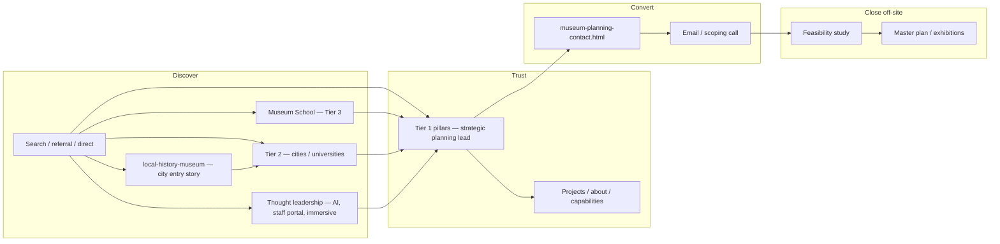

# Domains & objectives strategy — Museum Planning LLC

**Purpose:** High-level map of **business objectives**, **domains/properties**, **keyword ownership**, and **URL tiers** on museumplanning.com. Use with the tactical playbooks below—not as a replacement for them.

**Related docs**

| Doc | Role |
|-----|------|
| [`BUSINESS-AND-SEO-PLAYBOOK.md`](./BUSINESS-AND-SEO-PLAYBOOK.md) | Tier rules, new-page pushback, conversion funnel |
| [`seo-keyword-strategy.md`](./seo-keyword-strategy.md) | Keyword ↔ URL source of truth, legacy 301s, checklists |
| [`../SITE-STRATEGY.md`](../SITE-STRATEGY.md) | Audience priority (cities, science centers, universities) |
| [`museumplanner-org-sunset-redirects.md`](./museumplanner-org-sunset-redirects.md) | museumplanner.org → Museum School |

**Primary live site:** https://museumplanning.com  
**Repo:** `Museum-Planning-LLC/website-2.0`

---

## Business objective

**Primary revenue target:** ~$100K+ **museum strategic planning** engagements.

**Website job (one sentence):** Sell **high-trust consulting** on the full ladder—feasibility, strategic planning, master planning, exhibition design, opening-day support (typically **$40K–$200K+** per engagement)—by ranking for **five Tier 1 money keywords**, with **`museum-strategic-planning.html`** as the lead pillar for the primary revenue target, and converting to **Start a Conversation**.

**What the site is not:** a content farm, a standalone “museum cost calculator,” or a separate product company for AI/IoT.

**Voice on commercial pages:** **we / our practice** (not first-person **I** on pillars).

---

## Domain portfolio

| Domain / property | Status (June 2026) | Strategic role | Primary content home |
|-------------------|-------------------|----------------|----------------------|
| **museumplanning.com** | Live (GitHub Pages + Cloudflare) | **Canonical firm** — Tier 1 money keywords, conversion, proof | This repo (root) |
| **museum-ai.com** | Planned / SEO dashboard “soon” | **Thought leadership** on museum AI / networked institutions—not a separate product firm or Tier 1 competitor | `museum-ai/index.html` → also `https://museumplanning.com/museum-ai/` after deploy |
| **culture-planning.com** | Referenced on `convergence-era.html`; no site in repo | Optional **municipal / cultural systems** narrative; do not duplicate Tier 1 without a tier decision | TBD — or fold into `for-cities.html` + services |
| **museumcourses.com** | Dashboard: not connected | Separate **courses** line (if activated) | Not in website-2.0 |
| **museumplanner.org** | Sunset in progress | Legacy **Museum Planner** education brand → **Museum School** + 301s | [`museumplanner-org-sunset-redirects.md`](./museumplanner-org-sunset-redirects.md) |
| **museumplanning.com/museum-planner/** | Live (path on canonical domain) | **Brand capture** landing (“Museum Planner” navigational query); same funnel as home/services | `museum-planner/index.html` |
| **museum-experiences.com** | Live (book companion, out of repo) | ***Designing Museum Experiences*** (Bloomsbury 2021) — visitor-centered design; links back to firm | External; firm proof on museumplanning.com |
| **museums101.com** | Book / second edition (out of repo) | Education spine — nonprofit / public trust framing | Separate when timed |
| **museum-planner-2.0** (GitHub org repo) | Content source, not public site | Exhibition-design series HTML; rebuild via `tools/build_exhibition_design_series.py` | `Museum-Planning-LLC/museum-planner-2.0` |

**Rule:** One **primary domain** for firm authority (**museumplanning.com**). Other domains either **301 to a tier owner**, **host one practice landing**, or stay parked until IA is documented here.

---

## Funnel (how domains support the objective)

---

## Tier model (museumplanning.com)

### Tier 1 — money keywords (one URL per phrase)

**Objective:** Own commercial intent; do **not** create competing pages.

| # | Business capability | Money keyword(s) | Primary URL |
|---|-------------------|------------------|-------------|
| 1 | Firm / hire a planner | Museum planning | `/` → `index.html` |
| 2 | Full ladder / consultants | Museum planning services, museum consultants | `museum-planning-services.html` |
| 3 | Feasibility (paid gate) | Museum feasibility study | `museum-feasibility-study.html` |
| 4 | Governance & direction | Museum strategic planning | `museum-strategic-planning.html` |
| 5 | Building & program roadmap | Museum master planning | `museum-master-planning.html` |

**Conversion hub:** `museum-planning-contact.html`

---

### Tier 2 — commercial audience verticals (hire path)

**Objective:** Match **who** is buying (city, university, science center). Always **link up** to Tier 1—especially **`museum-strategic-planning.html`** for the primary revenue target. Sitemap priority ~**0.45**.

| Business focus | Typical keywords | Primary URL | Links up to |
|----------------|------------------|-------------|-------------|
| Municipal / civic museums | City museum feasibility, cultural destination | `for-cities.html` | Feasibility, **strategic planning**, services |
| City science & tech centers | Science center planning | `for-cities-science-center.html` | Feasibility, **strategic planning**, services |
| Universities | Campus museum, collection in storage | `for-universities.html` | Feasibility, master plan, **strategic planning** |

---

### Tier 2b — city entry story (not thought leadership)

**Objective:** Capture **local history / historic building** intent that often arrives **before** a city identifies as a “municipal feasibility” buyer. Route to **`for-cities.html`** and Tier 1—not a separate money keyword.

| Role | Typical keywords | Primary URL | Links up to |
|------|------------------|-------------|-------------|
| **City entry point** (historic building, community collection, historical society) | Local history museum, starting a local history museum, historic building museum | `local-history-museum.html` | **`for-cities.html`**, feasibility, **strategic planning** |

**Note:** `for-cities.html` remains the **municipal commercial** owner; `local-history-museum.html` is the **narrative on-ramp** many city and community leads actually land on first.

---

### Thought leadership (credibility — not primary hire path)

**Objective:** Show fluency in how museums are changing; **one soft CTA** up to **`museum-strategic-planning.html`** and contact. **Not** main nav competitors to Tier 1. Footer or “Lens” placement—not homepage hero.

| Topic | Typical keywords | URL | Links up to |
|-------|------------------|-----|-------------|
| Museum AI / networked institutions | Museum AI, smart museum, AI and museums | `museum-ai/index.html` | **Strategic planning**, convergence-era (optional) |
| Operating museum systems | Museum staff portal, employee handbook | `museum-staff-portal.html` | Strategic planning, for-cities |
| Immersive & interactive (lens) | Immersive museum planning, interactive exhibits | `immersive-museum-planning.html` | Services, projects—not a Tier 1 owner |
| Convergence / systems change | Future of museums, AI and cultural systems | `convergence-era.html` | Strategic planning, services |
| Field lens (annual) | Museum openings 2026, museum expansion, cultural institutions | `museum-projects-to-watch-2026.html` | Strategic planning, for-cities, contact |
| Institutional health | Museum benchmarking, vitality | `museum-vitality-index.html` | Strategic planning, contact |

**Rules**

- Do **not** position thought-leadership URLs as **$100K strategic plan** product pages; they support trust and outbound (LinkedIn, speaking).
- **Commercial** exhibition-design hire intent stays on **`museum-planning-services.html`** (not immersive guide).
- **`museum-ai/`** and **`convergence-era.html`** both discuss AI—**museum-ai** = practice narrative; **convergence-era** = white-paper depth; neither outranks **`museum-strategic-planning.html`**.

**Cultural planning (gap):** No Tier 1/2 page owns **museum cultural planning** as a phrase. Today:

- Legacy `/museum-consulting-and-cultural-planning-museum-planning-llc/` → `museum-planning-services.html`
- Municipal “cultural destinations” copy on `for-cities.html`
- **culture-planning.com** — not implemented in this repo

**Decision needed:** Absorb into Tier 2 (`for-cities` + services FAQ) **or** add a documented Tier 2 owner—avoid an orphan keyword.

---

### Tier 3 — Museum School (vocabulary only)

**Objective:** Answer “what is…?” and “how do I start…?” **without** replacing Tier 1 commercial owners.

| Topic | Keywords | URL | Must link up to |
|-------|----------|-----|-----------------|
| School hub | Starting a museum, feasibility overview | `museum-school/index.html` | School articles, services |
| Starting a museum | How to start a museum | `museum-school/how-to-start-a-museum.html` | `museum-planning-services.html`, contact |
| Feasibility vocabulary | What is a museum feasibility study | `museum-school/what-is-a-museum-feasibility-study.html` | `museum-feasibility-study.html` |
| Master plan vocabulary | What is a museum master plan | `museum-school/what-is-a-museum-master-plan.html` | `museum-master-planning.html` |
| Exhibition design series | Museum exhibition design | `museum-school/museum-exhibition-design/` (I–VI) | Services (commercial); immersive guide (thought leadership only) |

*Exhibition series body source:* **museumplanner.org** legacy → migrated from **`museum-planner-2.0`**; do not treat **museumplanner.org** as a commercial owner after sunset.

---

## Designing Museum Experiences (book + URLs)

**Business objective:** **Credibility and methodology proof** for exhibition design and visitor-centered planning—not a separate consulting SKU. Supports Tier 1 **services**; **`immersive-museum-planning.html`** is thought leadership only (see above).

| Layer | Keywords / intent | Primary URL | Tier | Matches objective? |
|-------|-------------------|-------------|------|-------------------|
| **Book companion site** | Designing museum experiences, visitor-centered museum design | **https://museum-experiences.com** (external) | Brand / product | **Yes** — book audience; must link to **museumplanning.com** for consulting |
| **Firm proof page** | Designing Museum Experiences (book), Mark Walhimer author | `projects/designing-museum-experiences.html` | Supporting / proof | **Yes** — project-style proof on canonical domain |
| **About / author** | Mark Walhimer, museum planning consultant | `museum-planning-about.html` (book block) | Supporting / brand | **Yes** |
| **Commercial exhibition design** | Museum exhibition design (hire intent) | `museum-planning-services.html` | Tier 1 | **Yes** — **do not** make the book or immersive URL a Tier 1 money page |
| **Education** | Museum exhibition design how-to | `museum-school/museum-exhibition-design/` | Tier 3 | **Yes** — vocabulary; links up to services; optional link to immersive (thought leadership) |

**Legacy 301s (museumplanning.com):**

| Legacy path | Target |
|-------------|--------|
| `/designing-museum-experiences-dme-process` | `museum-planning-services.html` |
| `/portfolio-item/designing-museum-experiences-book-by-mark-walhimer` | `museum-planning-about.html` |

**Rule:** *Designing Museum Experiences* reinforces **“we design visitor experience”**; **museum planning services** and **immersive-museum-planning** own **commercial** exhibition-design queries.

---

## Museum Planner (brand + sunset)

**Business objective:** Consolidate **Museum Planner** search and bookmark traffic onto **museumplanning.com** without a second consulting site. Educational legacy → **Museum School**; navigational “museum planner” → **path landing** or home.

| Layer | Keywords / intent | Primary URL | Tier | Matches objective? |
|-------|-------------------|-------------|------|-------------------|
| **Legacy domain** | Museum planner blog, exhibition design articles, starting a museum (old) | **museumplanner.org** → 301 to Museum School URLs | Sunset / Tier 3 destination | **In progress** — see sunset checklist |
| **Firm path (canonical)** | Museum planner, museum planning consultant | **https://museumplanning.com/museum-planner/** → `museum-planner/index.html` | **Brand landing** (not Tier 1) | **Yes** — captures brand query; canonical is museumplanning.com path, not .org |
| **Museum School hub** | Museum planner (footer link today) | `museum-school/index.html` | Tier 3 | **Yes** after sunset — replace footer links to .org with School index |
| **Exhibition design (migrated)** | Museum exhibition design parts I–VI | `museum-school/museum-exhibition-design/*` | Tier 3 | **Yes** — replaces museumplanner.org series |

**museumplanner.org → museumplanning.com (summary):**

| Legacy (museumplanner.org) | New owner |
|----------------------------|-----------|
| `/museum-exhibition-design-*` | `museum-school/museum-exhibition-design/` |
| `/starting-a-museum/` (planned) | `museum-school/how-to-start-a-museum.html` |
| Remaining blog / FAQ | Museum School or retire → closest guide |

**Do not:** Create a Tier 1 pillar for “museum planner” or duplicate exhibition-design commercial pages on museumplanner.org after sunset.

**Repo note:** Strategy/docs scaffolding for **Museum Planner** (non-production site) may live in **`Museum-Planning-LLC/museum-planner-2.0`** — separate from live **museumplanner.org** and from **`museumplanning.com/museum-planner/`**.

---

## Supporting URLs (proof & thought leadership)

Not keyword hubs; support trust and Tier 1 links.

| Role | Examples |
|------|----------|
| Project proof | `museum-planning-projects.html`, `projects/*.html` (incl. `projects/designing-museum-experiences.html`) |
| Brand / person | `museum-planning-about.html` |
| Brand landing | `museum-planner/index.html` (`/museum-planner/`) |
| Capabilities | `Museum_Planning_LLC_Capabilities.html` |
| Systems / future narrative | `convergence-era.html`, `museum-vitality-index.html` |

**AI narrative:** **museum-ai/** and **convergence-era.html** are both thought leadership; **museum strategic planning** remains the hire path. Do not run dual “product” CTAs from both AI pages.

---

## Objectives ↔ your topic list (quick audit)

| Topic | Objective fit | URL today | Match? |
|-------|---------------|-----------|--------|
| Museum feasibility studies | Core revenue / Tier 1 | `museum-feasibility-study.html` | **Yes** |
| Museum strategic planning | Core revenue / Tier 1 | `museum-strategic-planning.html` | **Yes** |
| Museum master planning | Core revenue / Tier 1 | `museum-master-planning.html` | **Yes** (in full five-keyword model) |
| Museum planning / consultants | Core revenue / Tier 1 | `index.html`, `museum-planning-services.html` | **Yes** |
| Museum AI | Thought leadership → strategic planning | `museum-ai/index.html` | **Yes** — not a separate SKU; demote nav |
| Museum staff portal | Thought leadership (operating museum) | `museum-staff-portal.html` | **Yes** — keep; soft CTA to strategic planning |
| Local history museum | **City entry** on-ramp | `local-history-museum.html` | **Yes** — **do not remove**; link to for-cities + strategic planning |
| Immersive museum planning | Thought leadership (exhibition lens) | `immersive-museum-planning.html` | **Yes** — **do not remove**; commercial hire stays on services |
| Museum cultural planning | Civic / services language, not a pillar | Services + `for-cities.html`; legacy 301 | **Partial** — no named owner |
| Museum School | Educate → link up | `museum-school/*` | **Yes** |
| Starting a museum | Informational → services | `museum-school/how-to-start-a-museum.html` | **Yes** |
| **Designing Museum Experiences** | Book credibility → services / immersive | `museum-experiences.com` + `projects/designing-museum-experiences.html` | **Yes** |
| **Museum Planner** | Brand + legacy education | `museum-planner/` + sunset **museumplanner.org** → Museum School | **Mostly yes** — finish .org 301s and footer link cleanup |

---

## Museum-AI (thought leadership — domain + URL)

**Business intent:** Narrative credibility for how planning incorporates AI and networked systems—not a **$100K strategic plan** product page. One CTA path: **museum strategic planning** + contact.

| Item | Current state | Target alignment |
|------|---------------|------------------|
| Deploy path | `museumplanning.com/museum-ai/` | **Keep**; footer / Lens—not main nav |
| Canonical in HTML | `https://museum-ai.com` | Align with live property or canonical to `/museum-ai/` |
| Sitemap | Optional | Low priority (~0.35 thought leadership), below Tier 1 |
| vs Convergence | Two AI touchpoints | Both thought leadership; **strategic planning** owns hire intent |

---

## Audience priority (who objectives serve first)

From `SITE-STRATEGY.md` — order matters for Tier 2 investment:

1. **Cities & municipalities** → `for-cities.html`, `for-cities-science-center.html`
2. **Science & technology centers** (civic scale)
3. **Universities & established institutions** → `for-universities.html`
4. **Breadth** — Museum School, generic services (qualify out hobby / strip-mall “museums” in copy)

---

## Open actions (IA hygiene)

- [ ] Add **thought leadership** rows (museum-ai, staff portal, immersive) to [`seo-keyword-strategy.md`](./seo-keyword-strategy.md)—not Tier 1/2 commercial
- [ ] Add `local-history-museum.html` as **city entry** (Tier 2b) in keyword strategy; cross-link from `for-cities.html`
- [ ] Optional: add `museum-ai/index.html` to sitemap at **low** priority (~0.35)
- [ ] Resolve **museum-ai.com** vs **museumplanning.com/museum-ai/** canonical
- [ ] Decide **cultural planning** owner (FAQ on for-cities + services vs new Tier 2 vs culture-planning.com redirect)
- [ ] Connect **museum-ai.com** in SEO dashboard when GSC property exists
- [ ] Document **museumcourses.com** objective if/when it launches
- [ ] Complete **museumplanner.org** 301s per [`museumplanner-org-sunset-redirects.md`](./museumplanner-org-sunset-redirects.md); GSC change-of-address
- [ ] Replace sitewide footer `museumplanner.org` links with `museum-school/index.html` or `/museum-planner/` after sunset
- [ ] Confirm **museum-experiences.com** prominently links to services + contact (book → consulting path)

---

## Revision log

| Date | Change |
|------|--------|
| 2026-06-03 | Initial domains ↔ objectives map; Museum-AI practice; cultural planning gap; cross-links to playbook |
| 2026-06-03 | Added **Designing Museum Experiences** (book, museum-experiences.com, proof URLs) and **Museum Planner** (museumplanner.org sunset, `/museum-planner/`, museum-planner-2.0 source) |
| 2026-06-03 | **Primary revenue target:** ~$100K+ museum strategic planning; strategic planning pillar named as lead URL for that target |
| 2026-06-03 | Reclassified museum-ai, staff portal, immersive as **thought leadership**; local-history as **city entry** (Tier 2b) |
